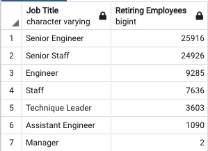
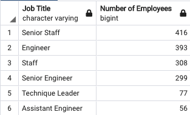

# Pewlett-Hackard-Analysis
## Overview
### Purpose
I was tasked with helping Pewlett Hackard, a large company with several thousand employees, prepare for an upcoming "silver tsunami" as many current employees reach retirement age. The company is offering a retirement package for those that meet certain criteria, and they are starting to think about which positions will need to be filled in the near future because of these retirements. I was tasked with performing employee research into who is retiring and how many employees are retiring. Additionally, Pewlett Hackard asked that I determine the number of retiring employees per job title and identify employees who are eligible to participate in a mentorship program.

## Results
Major Points from Analysis:
* 50,842 Senior level positions are occupied by employees set to retire
* 72,458 employees are set to retire ranging across 7 different job titles
* 1,549 employees met the mentorship criteria
* Only 6 of the 7 distinct job titles at Pewlett Hackard were represented by employees meeting mentorship criteria

## Summary
To answer the questions posed for me by Pewlett Hackard:

### 1. How many roles will need to be filled as the "silver tsunami" begins to make an impact?

As discussed in the results section, Pewlett Hackard will need to fill 72,458 positions with 50,842 of those positions being Senior level jobs. The 72,458 jobs account for nearly 25% of the current workforce at Pewlett Hackard, which will be a significant undertaking.

### 2. Are there enough qualified, retirement-ready employees in the departments to mentor the next generation of Pewlett Hackard employees?

As demonstrated in the figure above, there are plenty of qualified, retirement-ready employees in the departments to mentor the next generation of Pewlett Hackard employees. However, only employees in six different job titles meet the retirement mentorship criteria, so that leaves the manager position without representation. Pewlett Hackard must address this as two managers are set to retire.